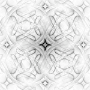

# CalcQPI

## A continuum Green's function code to simulate quasi-particle interference

Homepage: <https://wahl.wp.st-andrews.ac.uk/calcqpi>

Github: <https://github.com/gpwahl/calcqpi-release> (version accompanying preprint)

CalcQPI is a code to calculate quasi-particle interference using the continuum Green's function approach. It is based on a formalism developed by A. Kreisel, P. Hirschfeld and collaborators [1, 2] to model quasi-particle interference (QPI) and understand the electronic structure of quantum materials. 

Key references are:
1. A. Kreisel, P. Choubey, T. Berlijn, W. Ku, B. M. Andersen, and P. J. Hirschfeld. Phys. Rev. Lett. 114, 217002 (2015)
2. A. Kreisel, C.A. Marques, L.C. Rhodes, X. Kong, T. Berlijn, R. Fittipaldi, V. Granata, A. Vecchione, P. Wahl, and P.J. Hirschfeld. npj Quantum Materials 6, 1 (2021).

The calcQPI code uses tightbinding models provided in Wannier90 format (_hr.dat) and the corresponding wave functions to simulate the continuum local density of states, which provides a good approximation to what would be measured in a scanning tunneling microscope as quasi-particle interference. The code has been tested and used in a number of publications, and works well for square and hexagonal lattices.

### Compilation

CalcQPI requires the following libraries:
* FFTW3
* GSL
* MPI (for the MPI implementation)

for GPU versions:
* Cuda libraries (for the NVidia GPU version)
* HIP libraries (for AMD GPUs)
* Metal-cpp (<https://developer.apple.com/metal/cpp/>, for Apple GPUs)

For information about the installation, see [INSTALL](INSTALL.md).

### Running the code

The code is executed using `calcqpi filename` where filename provides the input file. 
